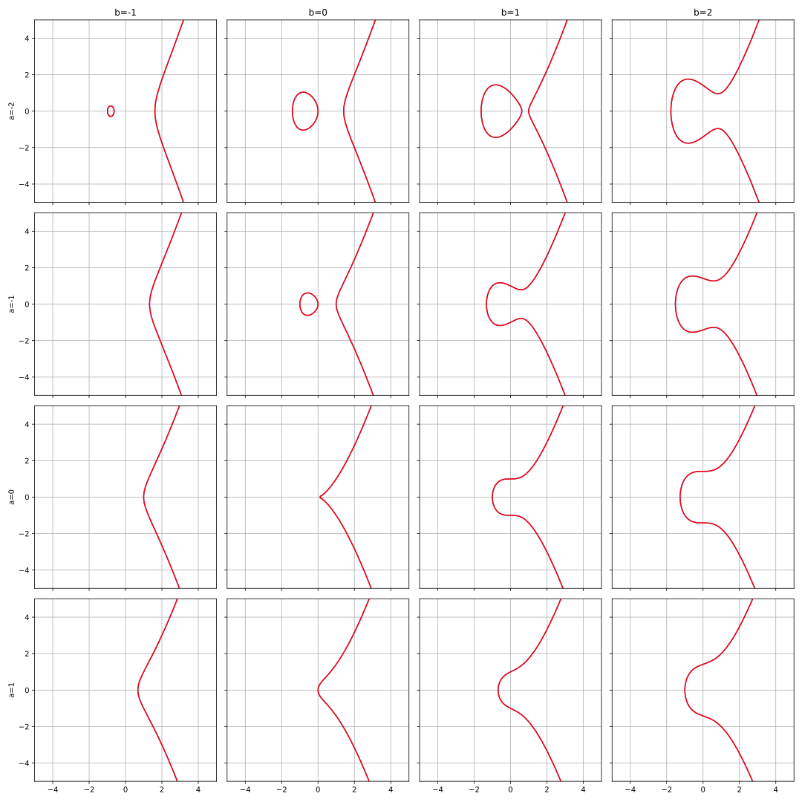
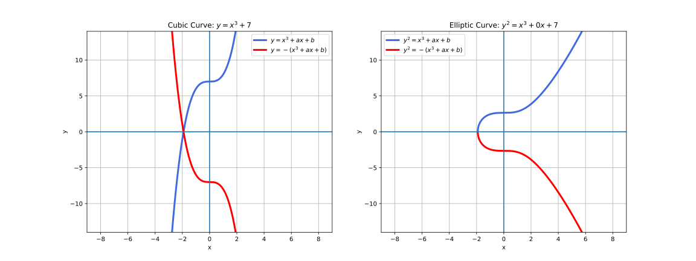
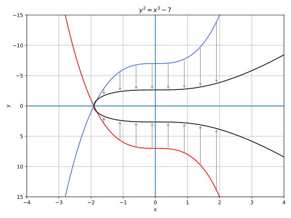

# Elliptic Curves
Elliptic curves have the following form:
$$y^{2}=x^{3} + ax + b$$

Different values for $a$ and $b$ have the following graphs:

The following graphs might help understand the elliptic curve graphs a bit better:

Comparing the cubic equation (left panel) and the elliptic curve (right panel), it might become a bit clearer how we end up with the elliptic curve. If you take the equation $y=x^{3} + ax + b$, then the elliptic curve shows all the real solutions to the equation $y=\sqrt{x^{3} + ax + b}$. When $x^{3} + ax + b < 0$, there are no real solutions so therefore they are not plotted in the elliptic curve.

## Application
For our cryptocurrency application, we use the elliptic curve because it is also used by Bitcoin. Apparently it is very efficient.

$$y^{2}=x^{3} + 7$$

## Point Addition
For every elliptic curve, a line will intersect it eiter at one point or three points, except in a couple of special cases.

The two exceptions are when a line is exactly vertical and when a line is tangent to the curve.

Point addition is defined as follows: pick two points $P_{1}$ and $P_{2}$ on the elliptic curve. They define a line, which must interesect the elliptic curve at a third point $P_{3}$. That third point is then relected over the x-axis and the result is $P_{1}$ + $P_{2}$.

Point addition satisfies certain properties that we associate with addition, such as:
- Identity
- Commutativity
- Associativity
- Invertibility

_Identity_ here means that there's a 'zero'. That is, there exists some point $I$ that, when added to a point $A$, results in $A$:

$$I + A=A$$

This is related to _invertibility_. For some point $A$, there's some other point $-A$, that results in the identiy point. That is:

$$A + (-A) = I$$

_Commutativity_ means that $A + B = B + A$. This is obvious since the line going through $A$ and $B$ will intersect the curve a third time in the same place, no matter the order.

_Associativity_ means that $(A + B) + C = A + (B + C)$. This property can be checked via an example. 

There are three cases for point addition
1. Where the points are in a vertical line or using the identiy point
2. Where the points are not in a vertical line, but are different
3. Where the two points are the same

### 1. $x_{1} = x_{2}$
The code for the vertical line is quite simple. When a point is added to the identity, the result must be the same point. 
When a point is added to its inverse, the result must be the identity (=point at infinty)

### 2. $x_{1} \neq x_{2}$

When we have points where the x's differ, we can add using a fairly simple formula. To help with intuition, we'll first find the slope created by the two points. We can figure this out using a formula from pre-algebra:

$$P_{1} = (x_{1}, y_{1}), P_{2}=(x_{2}, y_{2}), P_{3}=(x_{3}, y_{3})$$
$$P_{1} + P_{2} = P_{3}$$
$$s = (y_{2}-y_{1})/(x_{2}-x_{1})$$

This is the slope, and we can use the slope to calculate $x_{3}$. Once we know $x_{3}$, we can calculate $y_{3}$. $P_{3}$ can be derived using this formula:

$$x_{3} = s^{2} - x_{1} - x_{2}$$
$$y_{3} = s(x_{1} - x_{3}) - y_{1}$$

Plugging this into the elliptic curve equation, we get

$$y^{2}=x^{3}+ax+b$$
$$y^{2}=(s(x_{1} - x_{3}) - y_{1})^{2}=x^{3}+ax+b$$

Gathering all the terms, we get the following polynomial equation:

$$x^{3} - s^{2}x^{2} + (a + 2s^{2}x_{1} - 2sy_{1})x + b - s^{2}x_{1}^{2} + 2sx_{1}y_{1} - y_{1}^{2} =0$$

We also know that $x_{1}$, $x_{2}$ and $x_{3}$ are solutions to this equation, thus:

$$(x-x_{1})(x-x_{2})(x-x_{3})=0$$

$$x^{3} - (x_{1}+x_{2}+x_{3})x^{2} + (x_{1}x_{2} + x_{1}x_{3} + x_{2}x_{3})x - x_{1}x_{2}x_{3} = 0$$

From earlier, we know that:

$$x^{3} - s^{2}x^{2} + (a + 2s^{2}x_{1} - 2sy_{1})x + b - s^{2}x_{1}^{2} + 2sx_{1}y_{1} - y_{1}^{2} =0$$

There is a result from what's called Vieta's formula, which states that the coefficients have to equal each other if the roots are the same. The first coefficient that's interesting is the coefficient in front of $x^{2}$:

$$-s^{2} = -(x_{1}+ x_{2}+x_{3})$$

We can use this to derive a formula for $x_{3}$:

$$x_{3}= s^{2} - x_{1} - x_{2}$$

We can plug this into the formula for the line above:

$$y=s(x-x_{1})+y_{1}$$

But we have to reflect over the x-axis, so the right side has to be negated:

$$y_{3} = -(s(x_{3}-x_{1}) + y_{1}) = s(x_{1} - x_{3}) - y1$$

### 3. $P_{1}=P_{2} \land y = 0$
